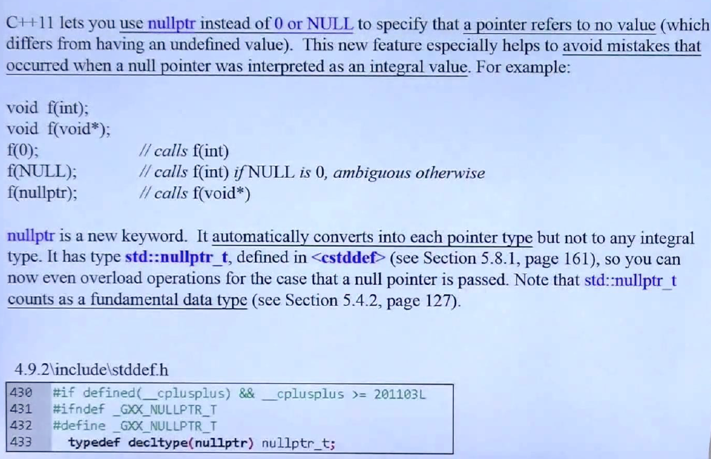
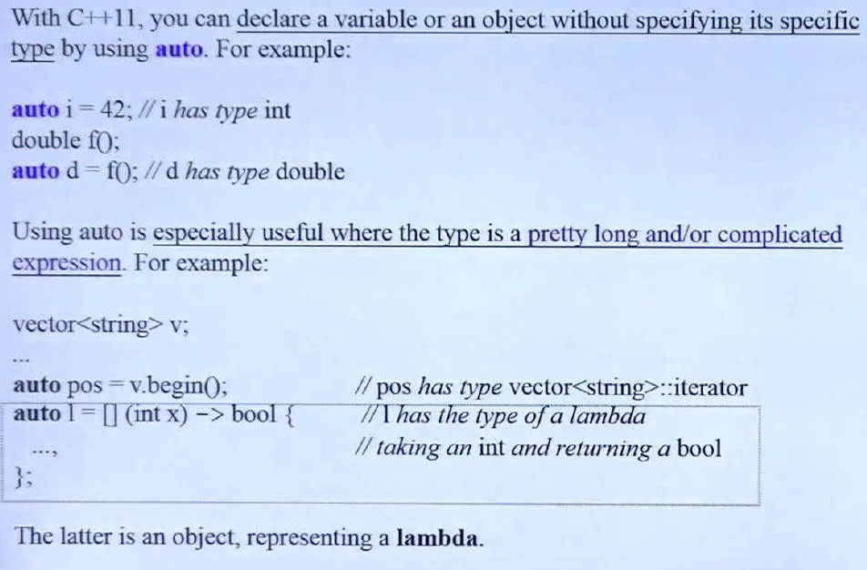
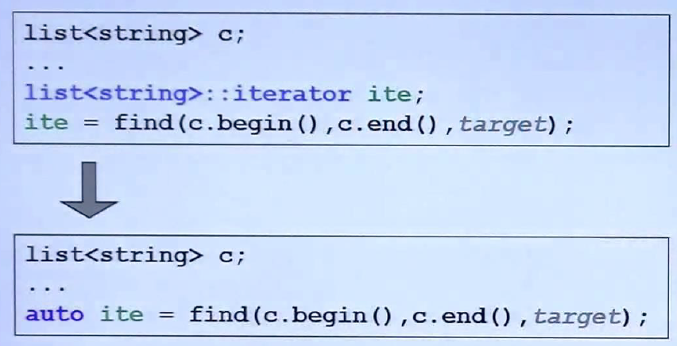
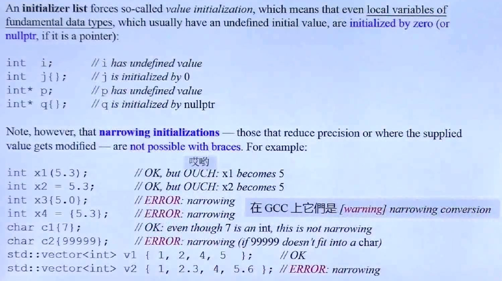
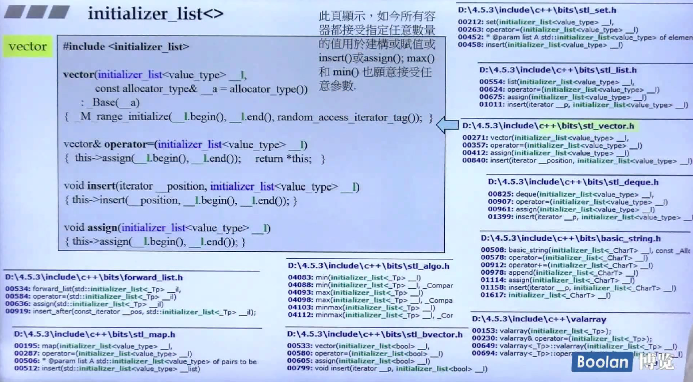
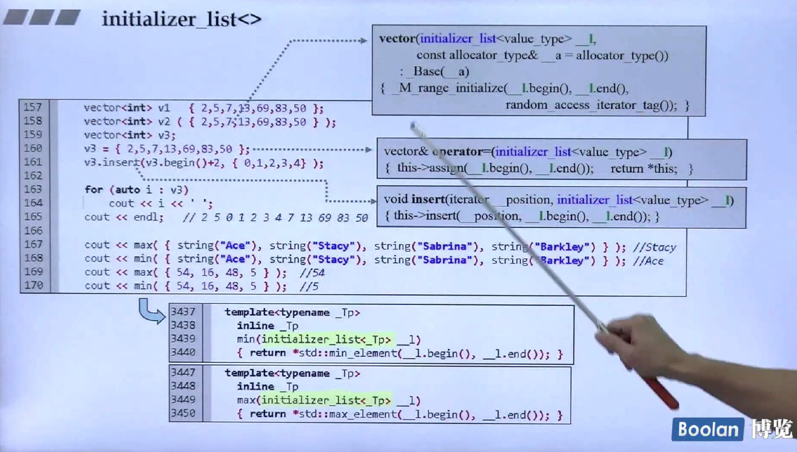

# C++11/14 笔记

这篇文章记录了学习侯捷老师C++11/14课程的笔记。C++11是C++2.0，引入了许多新的特性，将从语言层面和标准库层面（以header files形式呈现）来介绍这些新的特性。

[TOC]

## 语言层面
怎样确定C++环境是否支持C++11呢？
使用如下语句：

```c++
cout << __cplusplus << endl;
```

如果出现的头六位数是大于等于201103的，则支持C++11。

### 模板表达式中的空格


在C++11之前，模板后面的尖括号需要空格，C++11之后就不需要了。

### nullptr和std::nullptr_t



使用nullptr代替NULL和0来代表指针没有指向值。这可以避免把空指针当int而引发错误。上图中给出了函数调用的实例，使用nullptr不会出现这种问题，这是因为nullptr是std::nullptr_t类型，c++11以后，std::nullptr_t也是基础类型了，可以自己定义变量。

### 自动推导类型----auto



C++11之后，可以使用auto自动推导变量和对象的类型，而不需要自己手写出来，对于有非常复杂而长的类型来说，这是很方便的，另外auto还可以自动推导lambda表达式的类型，然后就可以把lambda函数当普通函数使用。

典型用法（更简单）：



标准库中的使用：


### 一致性初始化----Uniform Initialization


C++11引入了一个通用的初始化方式——一致性初始化，使用大括号括起来进行初始化，编译器看到这种初始化会转换成一个initializer_list<T>，然后要分两种情况：

- 如果对象带有接受initializer_list<T>的构造函数版本，那使用该构造函数进行初始化。（如上vector<string>初始化）
- 如果对象没有initializer_list<T>的构造函数版本，那编译器会将initializer_list<T>逐一分解，传给对应的构造函数。（如上complex初始化）

另外，如果函数的参数就是initializer_list<T>，那么就必须传入initializer_list<T>，而不能传入多个T参数。

### 初始化列表（initializer_list）



大括号可以设定初值（默认值），另外，大括号初始化不允许窄化转换（书籍上这样说的，实际gcc只会给出警告，但这不是好习惯）。


C++11提供了一个std::initializer_list<>, 可以接受任意个数的相同类型，上面是一个实例。


上图的左边是initializer_list在构造函数中的应用，右边是initializer_list的源代码，它的内部有一个array和一个长度，另外initializer_list的构造函数是私有的，但编译器当看到大括号的时候，就会调用这个构造函数，编译器有无上权力。initializer_list构造函数会传入array（C++11新提出的，对数组进行封装，可以使用算法库）的头部迭代器，以及它的长度。


上面是array的源代码，里面就是一个基本的数组，然后封装了begin和end迭代器。


左下脚是新东西，其他的之前出现过了，第一句话是指initializer_list背后有一个array在支撑，第二句话是说initializer_list并没有包含那个array，只是有一个指针指向那个array的头部和一个size_t等于array的长度。如果拷贝initializer_list，只是浅拷贝，指向同一个array以及得到同一个长度。最后一句话是说那个临时array的生命周期与initializer_list是相同的。



这是标准库中使用initializer_list的各个地方，非常之多，这里只列举vector里面的使用，有初始化，重载赋值运算符，插入以及分配。



上面的是具体事例以及对应调用有initializr_list的方法。

### explicit


这节在C++面向对象高级编程中有很多的补充，可以去看看，在构造函数前面加上explicit, 就是告诉编译器, 不要在将int类型隐式转成Complex, 只能通过显式地进行构造。


之前一张图是只有一个实参，这里是多个实参的例子，当使用运行p3{77, 5, 42}的时候，直接调用的是带有initializer_list的构造函数，而p5 = {77, 5, 42}, {77, 5, 42}是initialization_list<int>类型，对应的p5也是initialization_list<int>，它不能隐式转成P，更详细的可以参考https://stackoverflow.com/questions/30142484/explicit-constructor-and-initialization-with-stdinitializer-list/30142573 ，提问一模一样。