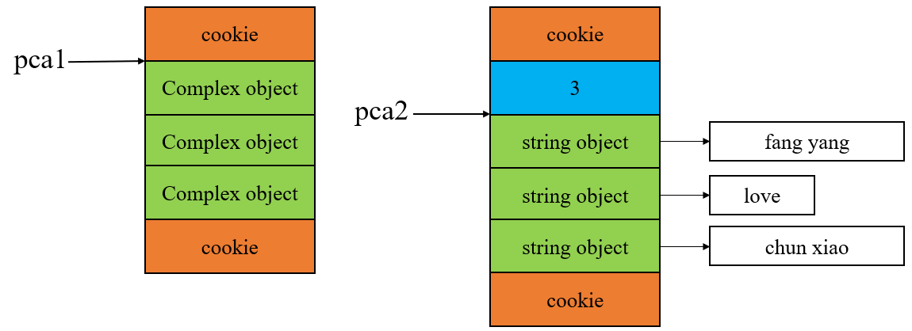

## C++内存管理笔记

## 前言

內存是计算机中的“脑”吗？CPU才是脑，CPU才是计算机的三魂六魄。但若沒有內存，一切只存在于虚无缥缈间，等同
于不存在。C++有一个很大的优势是用户可以动态分配内存，并加以控制，以达到最优性能。对于一个C++程序员，对内存有深厚的了解将使你的C++功力更上一层楼。而这篇文章则是分享学习侯捷老师的内存管理课的笔记，在此分享，希望各位学习内存管理有所帮助。

测试环境：VS2017和Clion2018.2 GNU C++14

## C++ Primitives

这一节介绍C++与内存相关的所有组件，包括malloc/free, new/delete, operator new/operator delete, placement new，将探讨它们的意义，运作方式和重载方式，并以此开发一个极小的内存池。

对于一个应用程序而言，使用内存的途径有下面几种方式：


看图形知道越往底层调用越费劲，并且高层内部调用低层，这里不会讲述O.S.API，这是操作系统级的API了，太过底层，所讲述的最低只到malloc和free这一层级，对于学过C语言的朋友来说，malloc和free是C语言动态分配内存的两个函数，malloc主管内存分配，free主管内存释放。new和delete是C++语言中动态分配的语法，类属表达式，分配一个对象的内存，相同的还有new[ ]和delete[ ]，这也是表达式，不过分配的是对象的数组。::operator new和::operator delete就是C++标准库的函数了，可以自己重载定制。allocator是C++标准库的分配器类，用于容器的参数，有默认分配器。下面的表格是它们的区别：

| 分配                     | 释放                       | 类属      | 可否重载                 |
| ------------------------ | -------------------------- | --------- | ------------------------ |
| malloc()                 | free()                     | C函数     | 否                       |
| new                      | delete                     | 表达式    | 否                       |
| ::operator new           | ::operator delete          | C++函数   | 可以重载                 |
| allocator<T>::allocate() | allocator<T>::deallocate() | C++标准库 | 可自由设计并搭配任何容器 |

现在来小试牛刀，使用上述的各种动态分配操作：

```c++
#include <iostream>
#include <complex>
#include <memory>				 //std::allocator
#ifdef __GNUC__
#include <ext\pool_allocator.h>	 //欲使用 std::allocator 以外的 allocator, 就得自行 #include <ext/...>
#endif

using namespace std;

namespace jj01
{
    void test_primitives()
    {
        cout << "\ntest_primitives().......... \n";

        void* p1 = malloc(512);	//512 bytes
        free(p1);
        
        char* p1_c = (char*)malloc(512); //char*指向512字节
        free(p1_c);
        
        complex<int>* p2 = new complex<int>; //one object
        delete p2;
        
        complex<int>* p2_array = new complex<int>[10]; //10 objects
        delete [] p2_array;

        void* p3 = ::operator new(512); //512 bytes
        ::operator delete(p3);

        //以下两函数都是 non-static，定要通过 object 调用。以下分配 3 个 ints.
    	int* p4 = allocator<int>().allocate(3);
    	allocator<int>().deallocate(p4,3);

#ifdef __GNUC__   //GNU C++
        //以下两函数都是 static，可通过全名调用之。以下分配 512 bytes. 早期版本GNU C++，新版已弃用！！
        //void* p4 = alloc::allocate(512); 
        //alloc::deallocate(p4,512);

        //以下两函数都是 non-static，定要通过 object 调用。以下分配 9 个 ints.
        int* p5 = __gnu_cxx::__pool_alloc<int>().allocate(9);
        __gnu_cxx::__pool_alloc<int>().deallocate(p5,9);
#endif
    }
} //namespace

int main(int argc, char** argv)
{
    jj01::test_primitives();
    return 0;
}
```

现在来看看new和delete的底层逻辑，对于下面这一行代码：

```c++
complex<int>* pc = new complex<int>(1, 2);
```

编译器会将它演绎成下面的形式：

```c++
complex* pc;
try{
    void* mem = operator new( sizeof(complex) ); //分配内存
    pc = static_cast<complex<int>*>(mem); // 指针转型
    pc->complex::complex(1, 2); //调用构造函数，注意，只有编译器才可以这样调用构造函数。不过老版本VC6支持。
}
catch( std::bad_alloc ) {
    //若分配内存失败，就不执行指针转型以及构造操作
}
```

对于new表达式来说，编译器会编译成上面三步：分配内存，指针转型，以及构造对象。对于上面的operator new函数，其VC98源代码如下：

```c++
void* operator new(size_t size, const std::nothrow_t&) _THROW0() //第二参数是为了不抛出异常
{
    void* p;
    while ((p == malloc(size)) == NULL)
    {
        //buy more memory or return null pointer
        _TRY_BEGIN // typedef
            if (_callnewh(size) == 0) break;
        _CATCH(std::bad_alloc) return NULL;
        _CATCH_END // typedef
    }
    return p;
}
```

可以看到operator new的内部调用的是malloc分配内存，当分配成功，直接返回指向分配好内存的指针，如果失败，malloc函数返回空指针，进入循环体，这里有两种方式处理，一种是调用_callnewh函数，这个是调用new handler函数（后面会讲，可以自己设定），当内存分配失败，此时说明内存不足，可以在new handler函数中释放掉某些不需要的内存，然后再进入循环判断条件调用malloc，第二种是直接返回空指针。

然后再来看看delete表达式，承接上面的new代码，当我们写出：

```c++
delete pc;
```

编译器会将它转为下面的程序：

```c++
pc->~complex();       //先析构      与上面通过指针调用构造函数不同，可以这样调用析构函数
operator delete(pc);  //然后释放内存
```

对于一个complex对象而言，complex内部没有指针，也就是它的内部没有指向其他内存，析构函数什么都不会做，operator delete(pc) 则是释放pc所指向的内存，也就是动态分配的complex对象。

对于operator delete函数，它的VC98源码如下:

```c++
void _cdecl operator delete(void* p) _THROW0()
{
    free(p);
}
```

可以看到operator delete内部调用就是free函数，直接释放内存。

通过上面的讲述，知道了malloc/free，new/delete以及operator new/operator delete的关系，在这里小结一下。new表达式内部会调用operator new，而operator new内部则会调用malloc，通过malloc分配内存，然后对指针转型，最后调用构造函数。而delete表达式则是先调用对象的析构函数，确保先将对象（如string）内部的动态分配内存在析构中释放，然后再通过operator delete函数，里面调用free函数释放对象的内存。

还剩下array new/array delete和placement new，现在来讲array new和array delete。

分下面两种情况：

```c++
//情况a
complex<int>* pca1 = new complex<int>[3]; //动态分配3个complex的空间，调用三次构造函数
delete [] pca1; // 调用三次析构函数和释放内存

//情况b
string* pca2 = new string[3];  //动态分配3个string（指针）的空间，调用三次构造函数
//对三个string进行赋值...
*pca2 = "fang yang";
*(pca2 + 1) = "love";
*(pca2 + 2) = "chun xiao";
delete [] pca2; //调用三次析构函数和释放内存
```

分两种情况是因为它们的内存情况不同（有简化），如下所示：



对于complex对象而言，析构函数可有可无，因为只需要让free(pca1)就可以达到释放内存的目的，而对于string对象来说，析构函数很重要，因为string内部的指针指向动态分配的字符内存，需要在析构函数将这部分内存释放，然后再调用free(pca2)释放string内部指针的内存。

> 对于free(pca1)为什么能够正确释放内存，有一个重要原因，那就是cookie，它的作用是记录内存块的起始位置和终止位置，所以就知道要释放多大的内存块。

知道了上面的原理，现在来说说为什么array new和array delete需要搭配使用，不搭配使用就是报错呢？

其实上面已经给出了答案，那就是构造函数和析构函数的次数问题，看看下面的代码：

```c++
string* pca2 = new string[3];
```

编译器转换为：

```c++
string* pca2[3];
try{
    void* mem = operator new( sizeof(string) * 3 ); //分配内存
    for (int i = 0; i < 3; i++){                  //三次转型和构造函数
    	pca2[i] = static_cast<string*>((mem + i)); // 指针转型
    	pca2[i]->string::string(); 
    }
}
catch( std::bad_alloc ) {
    //若分配内存失败，就不执行指针转型以及构造操作
}
```

同理，对于array delete：

```c++
delete [] pca2;
```

编译器转换为:

```c++
for (int i = 3 - 1; i <= 0; --i){
    pca2[i]->~string();
}
operator delete(pca2); 
```

如果将`delete [] pca2`换成`delete pca2`，那么析构函数就只调用了一次（调用一次发生在string没有析构函数，具体原因见下一段话），剩下的两个没有调用，那么当operator delete释放掉三个指针的内存后，其中两个指针当初所指向的内存就悬空了，没有指针指向，发生内存泄漏。

另外，上面的图，complex对象没有3（内置类型也不会有），而string对象有3，这是因为complex没有重要的析构函数，编译器不会记录3这个长度，而string则需要记录，`delete [] pca2`并没有带有3，这是因为当编译器看到`[]`，此时pca2没有指向string数组的首地址，而是回跳到3的地址（所以上面一段话中delete pca2其实会报错，多了一个3，内存布局变了），所以就知道析构多少次。

下面的是一个事例，帮助理解：

```c++
namespace jj02
{
    class A
    {
    public:
        int id;
        A() : id(0)      { cout << "default ctor. this="  << this << " id=" << id << endl;  }
        A(int i) : id(i) { cout << "ctor. this="  << this << " id=" << id << endl;  }
        ~A()             { cout << "dtor. this="  << this << " id=" << id << endl;  }
    };

    void test_call_ctor_directly()
    {
        int size = 3;
        A* buf = new A[size];  //动态分配调用default ctor 3 次. [0]先于[1]先于[2])
        //A必须有 default ctor, 否则 [Error] no matching function for call to 'jj02::A::A()'
        A* tmp = buf;

        cout << "buf=" << buf << "  tmp=" << tmp << endl;

        for(int i = 0; i < size; ++i)
            new (tmp++) A(i);  		//placement new, 3次 ctor

        cout << "buf=" << buf << "  tmp=" << tmp << endl;

        delete [] buf;    //dtor three times (次序逆反, [2]先于[1]先于[0])
    }
} //namespace

int main(int argc, char** argv)
{
    jj02::test_call_ctor_directly();
    return 0;
}
```

程序输出如下：

```c++
default ctor. this=0xf91258 id=0
default ctor. this=0xf9125c id=0
default ctor. this=0xf91260 id=0
buf=0xf91258  tmp=0xf91258
ctor. this=0xf91258 id=0
ctor. this=0xf9125c id=1
ctor. this=0xf91260 id=2
buf=0xf91258  tmp=0xf91264
dtor. this=0xf91260 id=2
dtor. this=0xf9125c id=1
dtor. this=0xf91258 id=0
```

上面的程序出现了placement new， 现在就进入placement new。

之所以只说placement new，这是因为没有所谓的placement delete，因为placement new没有分配内存，它的作用是将对象构建在已分配的内存（placement的含义）当中。关于placement new，指的是new(p)或者operator new(size, void*)。就像上面程序中的`new (tmp++) A(i)`， tmp是指向已分配内存的指针，A(i)则是在已分配内存当中执行构造函数。

> 关于placement delete，有的称呼placement new对应的operator delete为placement delete. 

现在来看看placement new到底做了什么，有以下程序：

```c++
char* buf = new char[sizeof(complex<int>) * 3]; //分配三个
complex<int>* pc = new(buf) complex<int>(1, 2);
//...
delete [] buf;
```

对于`complex* pc = new(buf) complex(1, 2)`这句话，编译器会转换为下面代码：

```c++
complex* pc;
void* mem = operator new( sizeof(complex<int>), buf ); //直接返回buf指针
pc = static_cast<complex<int>*> (mem);				 //指针转型
pc->complex::complex(1, 2);							//调用构造函数
```

对于上面的operator new，就和之前的operator new不太一样了，它现在多了第二参数，它的代码如下：

```c++
void* operator new(size_t, void* loc)
{
    return loc;
}
```

可以看到直接返回buf指针，啥都没做，所以placement new做的事有两件，一件转型，一件调用构造函数。