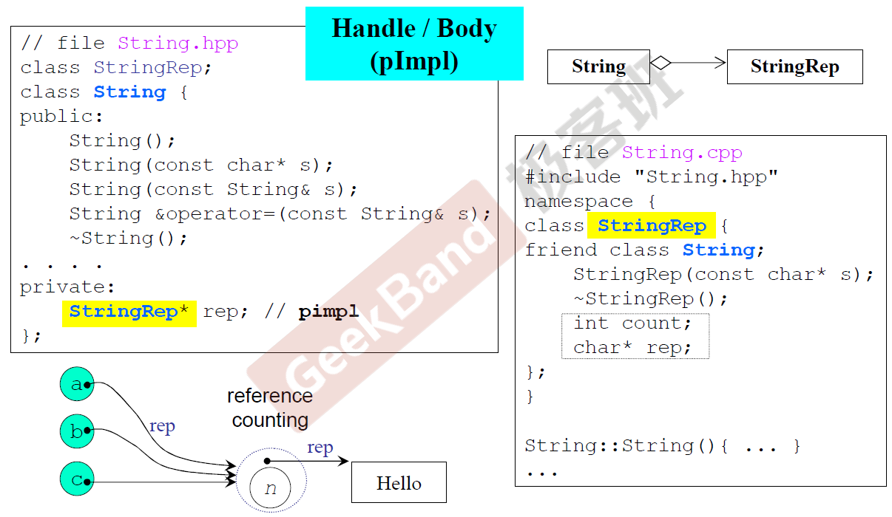
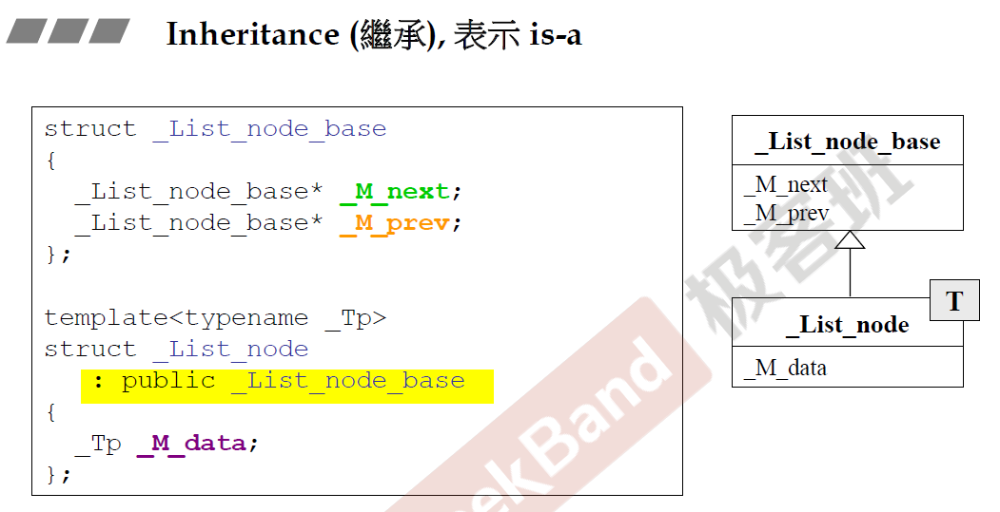

# C++面向对象程序设计_Part2

part1讲述了基于对象，part2则是在基于对象的基础上，建立类与类之间的联系，即面向对象编程以及面向对象设计。

主要讲述以下三点：

- Inheritance （继承）
- Composition（复合）
- Delegation （委托）

另外，我把补充内容中的对象模型放入到Part2，我觉得放入这里更加合适。

[TOC]

## Composition（复合）

Composition（复合）就是has a， 上面的事例就是队列（queue）类中有一个双端队列（deque）类，队列中的成员函数通过双端队列的操作函数完成，这是类与类之间的第一个关系。（黑色菱形代表内部拥有）

deque中可能拥有很多方法，但queue中只通过deque提供了非常少的方法，这是一个设计模式Adapter，将一个拥有许多功能的类改造一下，得到另一个类。

## 内存视角下的composition（复合）

可以看到有两个复合关系，最后queue的内存是40.

## composition（复合）关系下的构造与析构

由于Container类是拥有Component类，所以在构造方面，先调用Component类的默认构造函数，然后再调用Container的构造函数，由内而外的构造，里面做好了，再做外面。析构则相反，先对Container进行析构，然后再对Component进行析构，过程是由外而内，将外面的去掉，才能看到里面去掉里面，符合常识。

## Delegation (委託) —— Composition by reference

如果一个类（string）中拥有一个指针（StringRep*），该指针指向的是另一个类（StringRep），这种关系是Delegation（委托），更好的说法就是Composition by reference（学术界不说by pointer），两种类的生命周期不一样，与复合两种类会同时初始化不同，委托当需要用的时候再进行初始化。上图中的实例是一种非常有名的设计，叫handle/body，指针指向的类负责具体实现，可以看到有一个//pimpl，意思是pointer to implement，而拥有那个指针的类只提供外界接口，就是基于委托这种方式，Handle（string）是提供给外界的接口，body（StringRep）就是实现部分，为什么这么有名，这是因为String类设计好了就不需修改了，只需要修改实现的那一个类，具有很好的弹性，另外，还有可以进行共享机制（减小内存），下图的a，b，c共享一个StringRep，这种方式叫做reference counting，当需要修改其中一个时，需要把内容copy出来一份进行修改，另外两个依然指向原StringRep。（白色菱形代表指针指向）

## Inheritance （继承）

继承的语法就是在类名后加上：public（还可以是protected，privated）你想要继承的类

