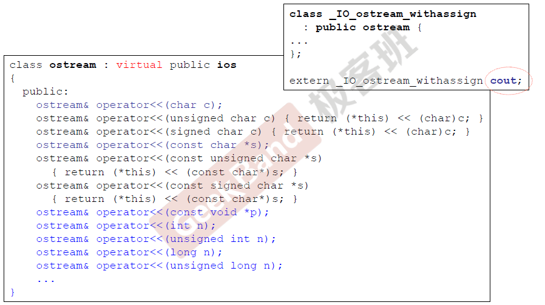
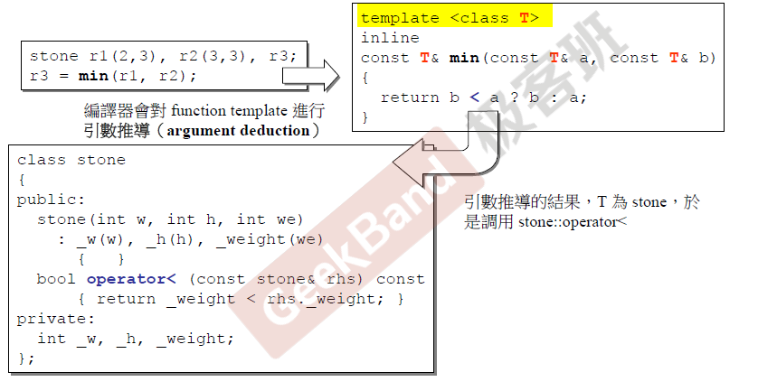
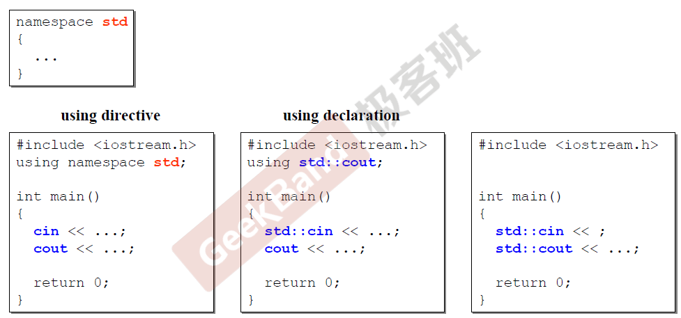

# 面向对象高级编程补充内容

课程除了将面向对象以外，还补充了一些其他内容，在这里进行介绍。

[TOC]

## static与this

没有static类型的变量或者函数时，complex类的成员函数是只有一份代码，通过this指针（谁调用谁的地址就是this）来调用不同的对象，this指针是一个默认会传入的参数，比如在调用real这个函数时，直接返回的是re，但编译器会在前面加上this->，用来指明是调用对象的re。而加上static，static所声明的变量和函数与this是没有关系的，无法通过this调用static类型的变量和函数，那有什么用呢，比如，在银行存储不同用户的存款时，c1，c2和c3代表的是用户自身的数据，但有的数据跟用户的数据没有关系，比如利率，这时候就可以将利率声明为static，所有对象都可以访问（静态作用域为全局）。如下图：

静态的数据在类中声明后，要在外面进行定义，静态set_rate函数操作静态m_rate（静态变量一般通过静态函数进行修改），调用静态set_rate函数，有两种方法，如上所示，在通过object调用时，不会传入this指针，这点要注意。

## 构造函数放入private（单例模式）

这个在part1提过，侯捷老师更加仔细地进行了讲解，这是一种有名的设计模式（单例模式），只能创建一个对象，由于构造函数放入private中，所以不能通过对象名直接创建，具体做法时在private里面创建一个static类型的对象，作用全局，通过public中的静态函数进行访问。然后就可以调用其他非静态的成员函数了。以下是上例更好的写法：

当没有调用getInstance，静态对象不会创建，只有调用getInstance时，才会有静态对象，这样写法更好。

## cout

cout为什么能够访问那么多不同类型的变量，这里给出了原因，图像右上角可以直到cout是ostream类的一种，与代码中用ostream吻合。然后看看ostream的定义，可以看到ostream里面重构了好多`<<`操作符，各种各样的类型，这也就是为什么cout可以打印各种不同类型的数据的原因。

## 类模板

模板类是由于考虑到可能会存放不同类型的数据和函数，所以不先定义类型，例如，当上面出现complex<double>, 编译器会将模板类的代码中的T替换为double，创造新的一份代码，遇到complex<int>时，会将模板类的代码中的T替换为int，在创建一份代码。可以看到模板类的代码是一份多用，很方便。

## 函数模板

函数模板与类模板差不多，不同的是编译器会对function进行实参推导，不需要指明类型，只要比较大小的对象重构了`<`操作符，这样设计是很合理的，比大小的函数都是那么写，而设计stone的人，它的责任就要重载`<`操作符，把责任分开是很好的。

## namespace

上面的是使用命名空间的三种写法。namespace可以防止冲突，比如在开发一个项目时，不同的人可能会命名相同的函数以及相同的参数，这时候需要不同的人给各自的代码设立不同命名空间，这样即使函数重名也不必担心了。