# 面向对象高级编程补充内容

​                                       作者：方阳，笔记地址：https://github.com/FangYang970206/Cpp-Notes

课程除了将面向对象以外，还补充了一些其他内容，在这里进行介绍, 课程中有一部分涉及C++11, 我没有写出来,放到C++11部分专门去讨论, 另外, 下面有一些部分来自于[hujiese]([https://github.com/hujiese/C-Enhance-for-OOP/blob/master/%E4%B8%8B%E7%AF%87/C%2B%2B%E9%AB%98%E7%BA%A7%E5%9F%B9%E8%AE%AD%E7%AC%94%E8%AE%B0%E4%B8%80.md](https://github.com/hujiese/C-Enhance-for-OOP/blob/master/下篇/C%2B%2B高级培训笔记一.md))的笔记, 我进行了一些补充, 减小工作量.

[TOC]

## static与this

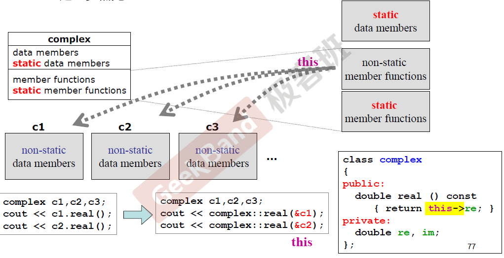

没有static类型的变量或者函数时，complex类的成员函数是只有一份代码，通过this指针（谁调用谁的地址就是this）来调用不同的对象，this指针是一个默认会传入的参数，比如在调用real这个函数时，直接返回的是re，但编译器会在前面加上this->，用来指明是调用对象的re。而加上static，static所声明的变量和函数与this是没有关系的，无法通过this调用static类型的变量和函数，那有什么用呢，比如，在银行存储不同用户的存款时，c1，c2和c3代表的是用户自身的数据，但有的数据跟用户的数据没有关系，比如利率，这时候就可以将利率声明为static，所有对象都可以访问（静态作用域为全局）。如下图：

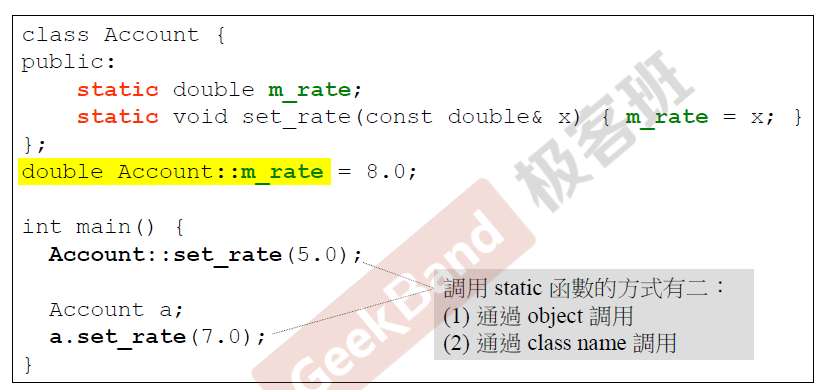

静态的数据在类中声明后，要在外面进行定义，静态set_rate函数操作静态m_rate（静态变量一般通过静态函数进行修改），调用静态set_rate函数，有两种方法，如上所示，在通过object调用时，不会传入this指针，这点要注意。

## 构造函数放入private（单例模式）

这个在part1提过，侯捷老师更加仔细地进行了讲解，这是一种有名的设计模式（单例模式），只能创建一个对象，由于构造函数放入private中，所以不能通过对象名直接创建，具体做法时在private里面创建一个static类型的对象，作用全局，通过public中的静态函数进行访问。然后就可以调用其他非静态的成员函数了。以下是上例更好的写法：

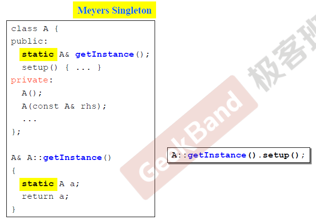

当没有调用getInstance，静态对象不会创建，只有调用getInstance时，才会有静态对象，这样写法更好。

## cout

cout为什么能够访问那么多不同类型的变量，这里给出了原因，图像右上角可以直到cout是ostream类的一种，与代码中用ostream吻合。然后看看ostream的定义，可以看到ostream里面重构了好多`<<`操作符，各种各样的类型，这也就是为什么cout可以打印各种不同类型的数据的原因。

## 类模板

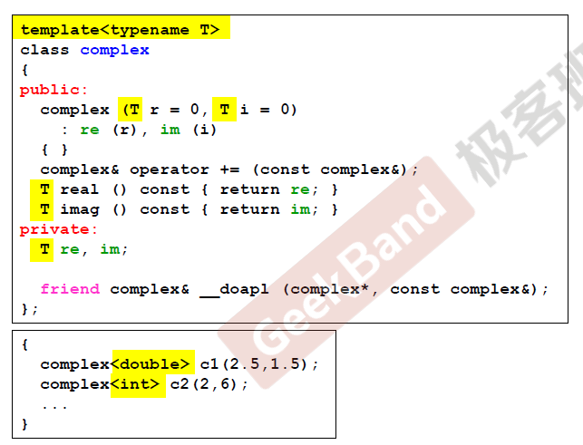

模板类是由于考虑到可能会存放不同类型的数据和函数，所以不先定义类型，例如，当上面出现complex<double>, 编译器会将模板类的代码中的T替换为double，创造新的一份代码，遇到complex<int>时，会将模板类的代码中的T替换为int，在创建一份代码。可以看到模板类的代码是一份多用，很方便。

## 函数模板

函数模板与类模板差不多，不同的是编译器会对function进行实参推导，不需要指明类型，只要比较大小的对象重构了`<`操作符，这样设计是很合理的，比大小的函数都是那么写，而设计stone的人，它的责任就要重载`<`操作符，把责任分开是很好的。

## 成员模板

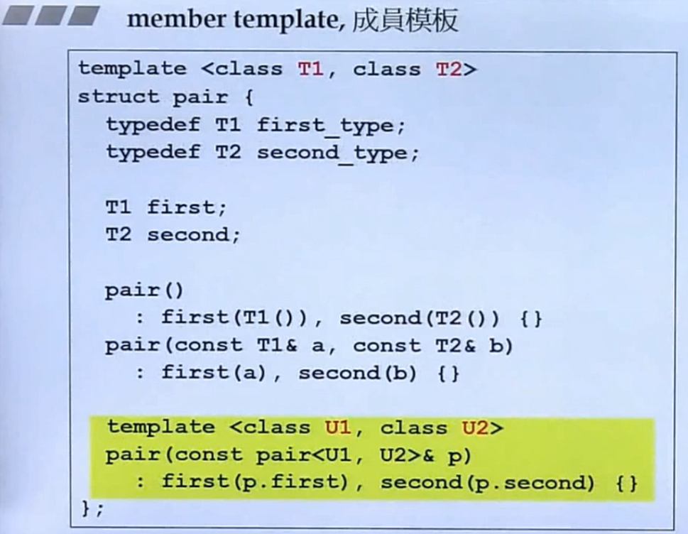

成员模板在泛型编程里用得较多，为了有更好的可扩展性，以上图为例，T1往往是U1的基类，T2往往是U2的基类，可以看下面这个例子： 

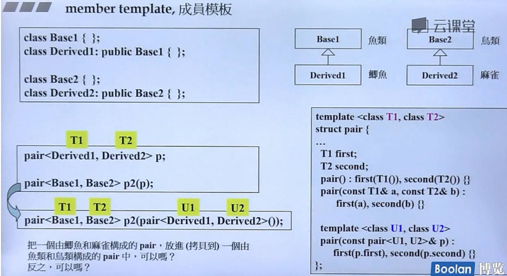

通过这种方法，只要传入的U1和U2的父类或者祖类是T1和T2，那么通过这样的方式可以实现继承和多态的巧妙利用，但反之就不行了。这样的方式在STL中用得很多： 

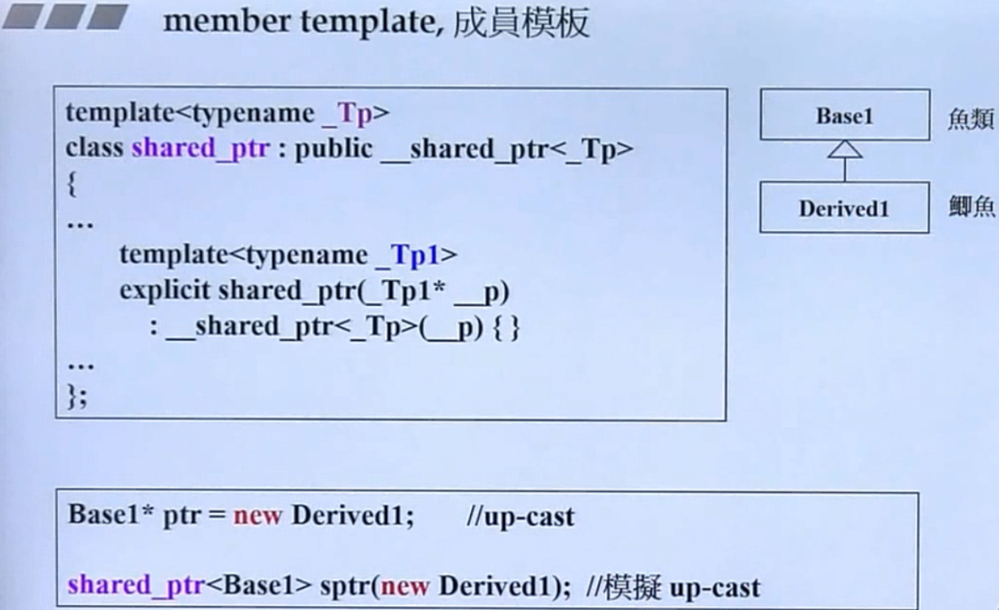

## namespace

上面的是使用命名空间的三种写法。namespace可以防止冲突，比如在开发一个项目时，不同的人可能会命名相同的函数以及相同的参数，这时候需要不同的人给各自的代码设立不同命名空间，这样即使函数重名也不必担心了。

写测试案例可以使用namespace，防止命名冲突，很方便。

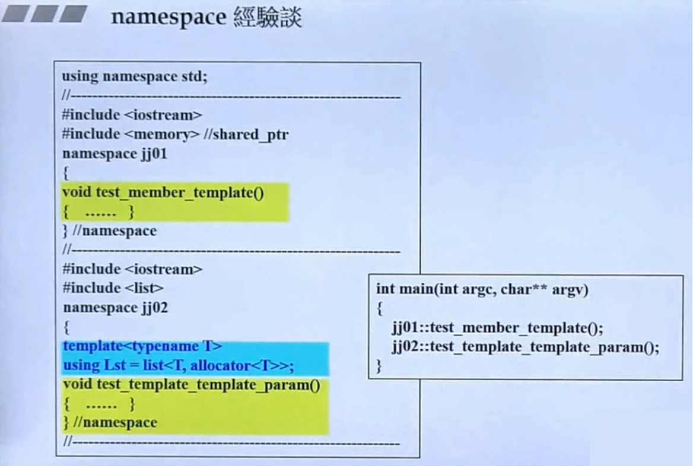

## 转换函数

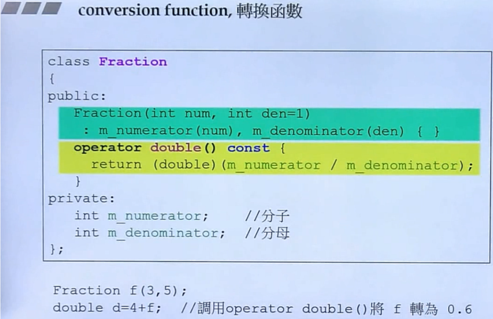

转换函数是将对象类型转为另一个对象类型，如上面的Fraction类，它的数据为分子和分母，当Fraction类与double进行操作时，会自动调用double类型的转换函数（转换函数是operator开头，后面接要转换的类型然后加括号）。以下面的事例为例，编译器在分析double d = 4 + f过程中判断4为整数，然后继续判断f，观察到f提供了double()函数，然后会对f进行double()操作，计算得到0.6，再与4相加，最后得到double类型的4.6。（转换函数一般不会改变数据，通常要加const）

## explicit与隐式转换

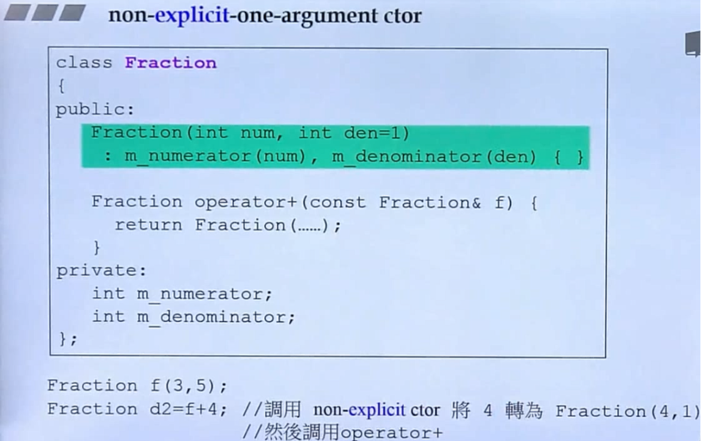

上图中定义了一个类，叫Fraction，类里面重载了“+”运算符，在f+4操作过程中，“4”被编译器隐式转换（通过构造函数）为Fraction对象，然后通过Fraction重载的“+”运算符参与运算。

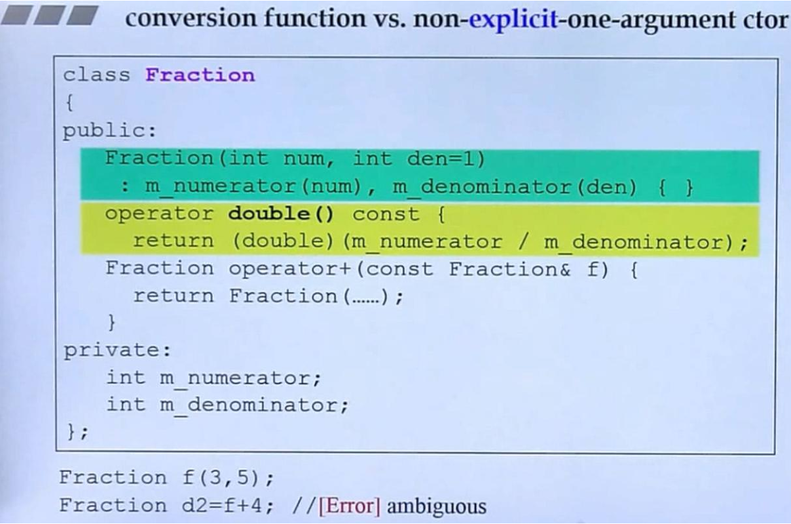

如上图所示，在Fraction中增加了double()函数，将Fraction的两个成员变量进行除法运算，然后强制转化为double类型并返回结果，在f+4重载过程中编译器将报错，可以做出如下分析：

1、首先4被隐式转化（构造函数）为Fraction对象，然后通过重载的“+”运算符与“f”进行运算；

2、首先f被转化（转换函数）为double，然后两个double进行相加;

两种路径都可行，编译不知道执行哪一种，产生ambiguous error. 下面是解决方案.

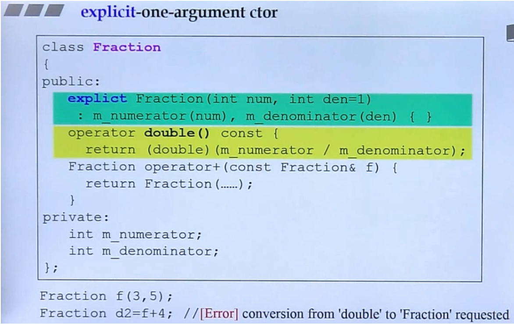

通过在构造函数前面加上explicit, 就是告诉编译器, 不要在将int类型转成Fraction, 只能通过显式地进行构造.那么再执行那条语句是, 就是执行两个double相加, 但是由于double转Fraction的转换函数没有实现, 所以报错.

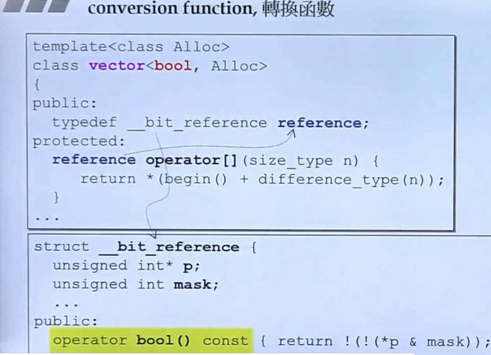

上面是STL的例子, 对于vector<bool>的operator[], 应该返回的是bool, 但是确实返回的是另一种类型, 那么这种类型应该有转换为bool的转换函数, 果不其然.

## pointer-like classes ---- 智能指针和迭代器

c++类构建出来, 所产生出来的对象可能像一个指针, 或者一个函数, 这一节是讲述像指针.

上述例子是智能指针, 智能指针是对原始的指针进行了包装, 赋予更多的功能, 其中主要是对内存进行自动管理 防止内存泄漏. 由上图可以看出, 智能指针在语法上有三个很关键的地方，第一个是保存的外部指针，对应于上图的T* px，这个指针将代替传入指针进行相关传入指针的操作；第二个是重载“*”运算符，解引用，返回一个指针所指向的对象；第三个是重载“->”运算符，返回一个指针，对应于上图就是px。这里的重载"->"运算符很有意思, 返回的是px, sp->method就变成了pxmethod, 实则不是, 还是px->method, 原因是操作符"->"比较不一样, 它会一直以"->"指下去, 直到指到对象的方法或数据.

迭代器也是一种智能指针，这里也存在上面提到的智能指针的三个要素，分别对应于下图的红色字体和黄色标注部分：

下面将仔细分析迭代器重载的“*”和“->”重载符：

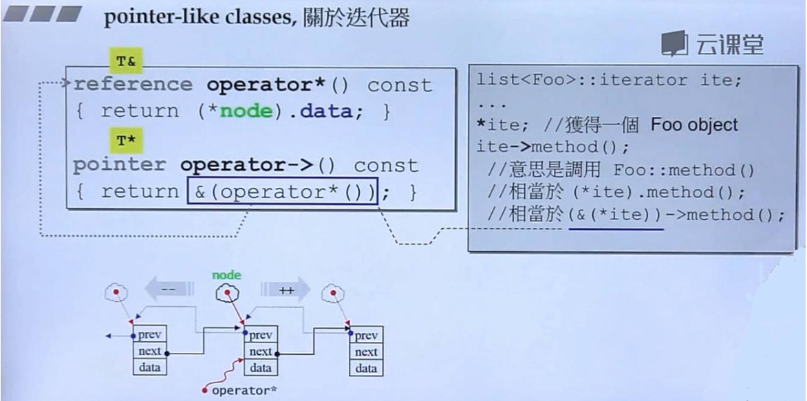

创建一个list迭代器对象，list::iterator ite;这里的list用于保存Foo对象，也就是list模板定义里的class T，operator*()返回的是一个(*node).data对象，node是__link_type类型，然而__link_type又是__list_node<T>*类型，这里的T是Foo，所以node是__list_node<Foo>*类型,所以(*node).data得到的是Foo类型的一个对象，而&(operator*())最终得到的是该Foo对象的一个地址，即返回Foo* 类型的一个指针。

## function-like classes ---- 仿函数

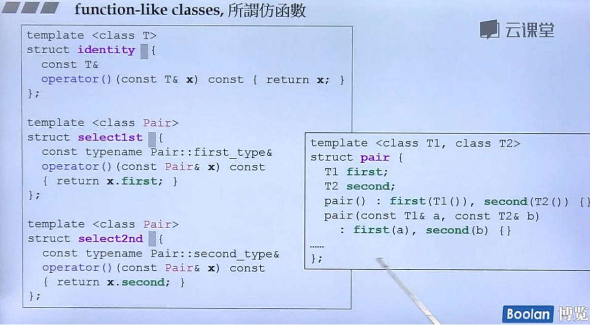

从上图可以看到，每个仿函数都是某个类重载“()”运算符，然后变成了“仿函数”，实质还是一个类，但看起来具有函数的属性。每个仿函数其实在背后都集成了一个奇怪的类，如下图所示，这个类不用程序员手动显式声明。 

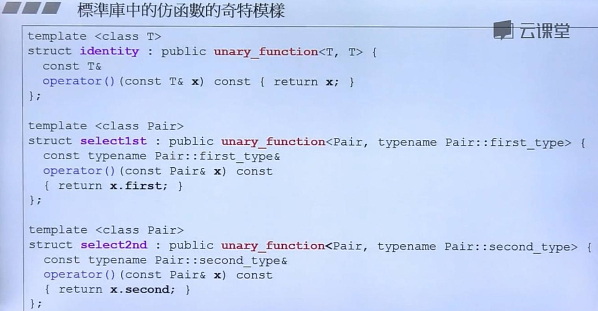

标准库中的仿函数也同样继承了一个奇怪的类： 

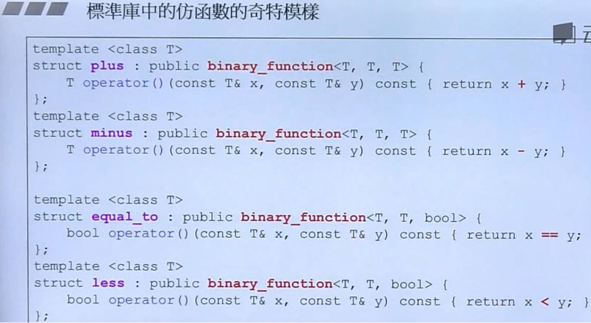

这个类的内容如下图所示，只是声明了一些东西，里面没有实际的变量或者函数，具体的内容将在STL中讨论。

## 模板特化

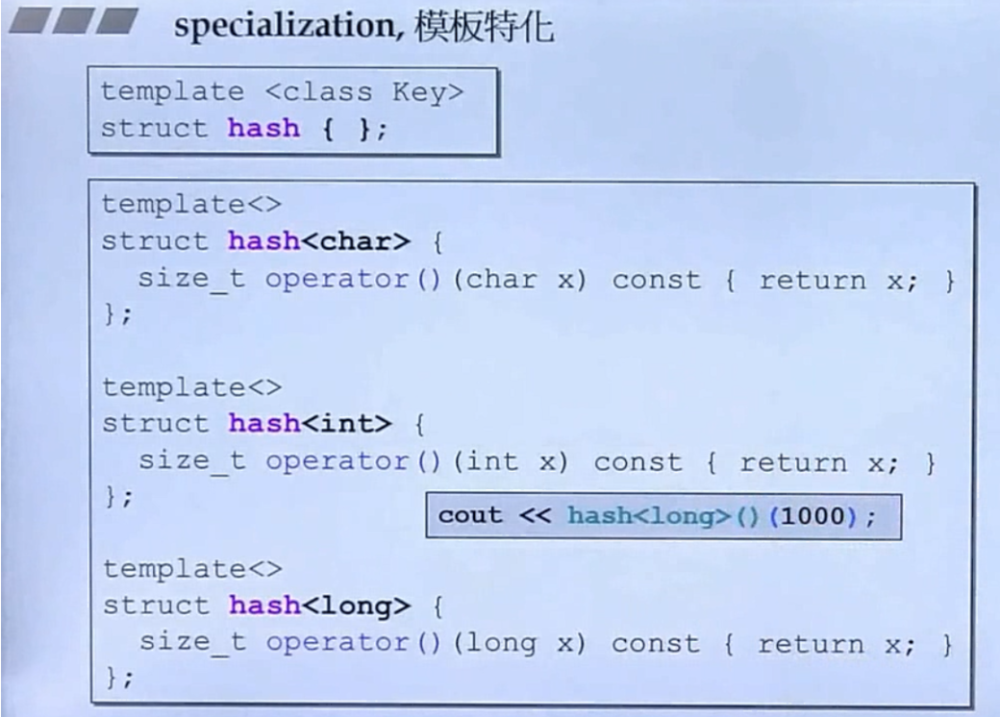

模板特化指的是模板中指定特定的数据类型, 这样在调用指定类型的模板时, 用的是特化的版本(如上面的hash<char>, hash<int>, hash<long>), 而不是泛化的版本(原始版本hash).

## 模板偏特化

模板特化也有程度之分，可以部分类型指定，称之为偏特化, 偏特化有两种, 一种是个数的偏, 一种是范围的偏. 

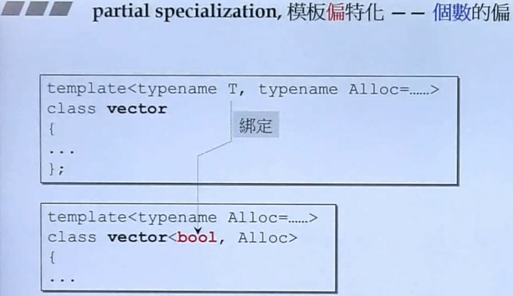

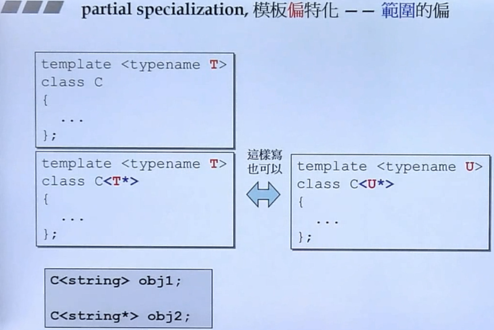

第一个图是个数上的偏, 绑定部分类型, 第二个图是范围上的偏, 原始版本C是可以指向任何类型, 下面的C特指指针类型, obj1是class C构造的, obj2是 class C<T*>构造的.

## reference

reference可以看做是某个被引用变量的别名。 

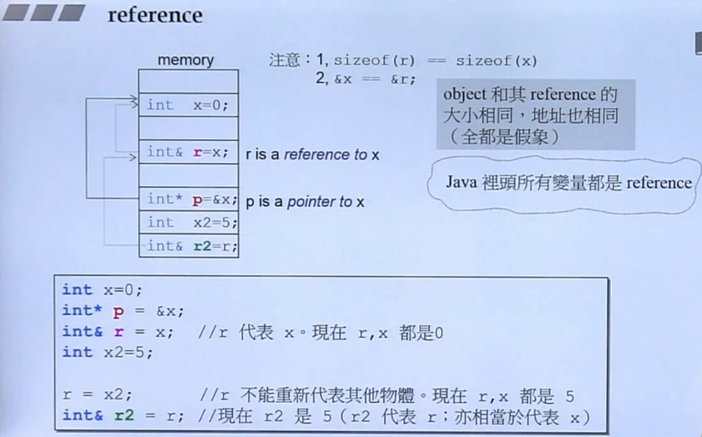

## new 和 delete

在面向对象程序设计_part1谈到了一些new和delete的原理，重复的内容不再讲述，补充内容讲述了重载new和delete。这里有篇很不错的博客，也可以进行参考：<https://www.jianshu.com/p/d2d5cdd7aa1d>

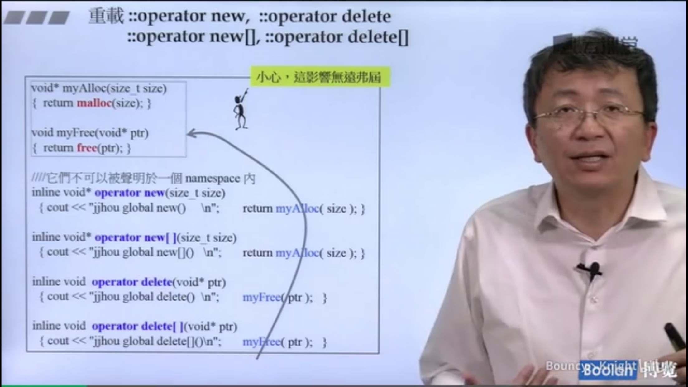

上面是重载new和delete的范例，和运算符重载类似，先是operator，然后后面介绍new，new和delete有两种格式，基于单个的new，以及基于array的new，所以上面有两种写法。有中括号的是基于array的。重载new的函数参数是根据要分配的对象的size推导的。重载delete的函数参数则是被释放对象的地址。上图中的重载是直接重载全局的new和delete，影响很大，出现内存泄漏很危险。

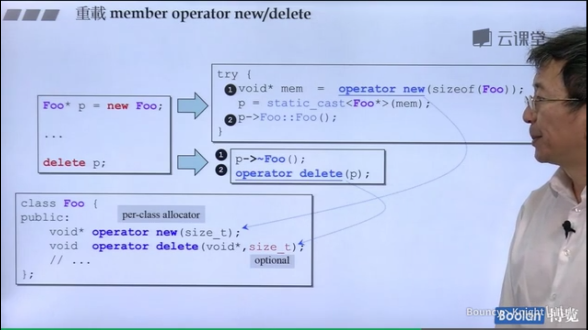

上图中则是重载单个成员的new和delete操作符，更加适用。相应地，左边执行new和delete运算，将会映射到右边的步骤。

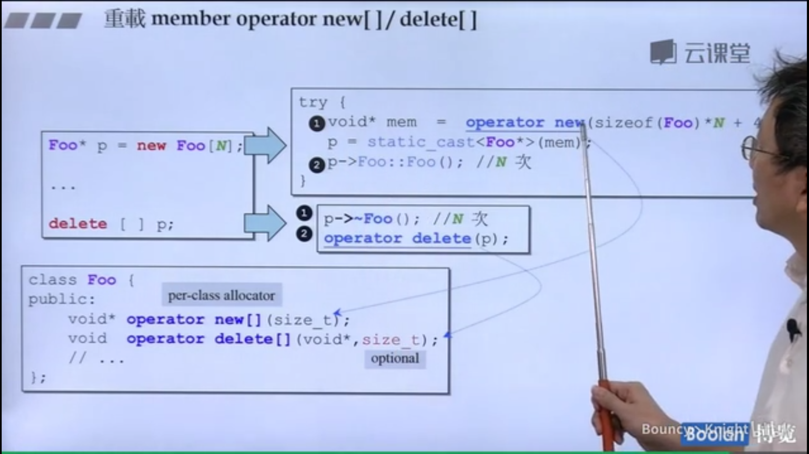

相应地，也有基于array的重载对象的。上面的分配N个Foo对象，可以看到sizeof(Foo)*N + 4，这里的4存放的是N这个数，这样到时候就知道要调用多少次构造函数和析构函数了。

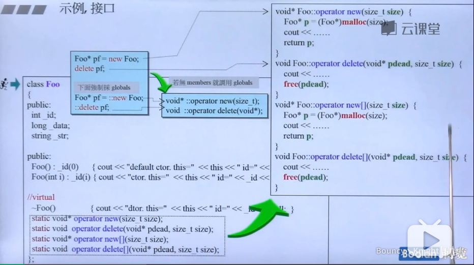

下面是一个更具体地事例，对Foo类重载了new和delete操作符，Foo有三个数据，12个字节，上图中主要要注意重构类的new和delete要怎么写，另外，在new前面加上::, 代表的是强制使用全局的new和delete操作符。

调用左边的语句，中间是输出，上面的是无虚函数，下面是有虚函数，对于基于array的new和delete，会多出四个字节，用来保存长度信息，构造是从下到上，析构是从下到上。

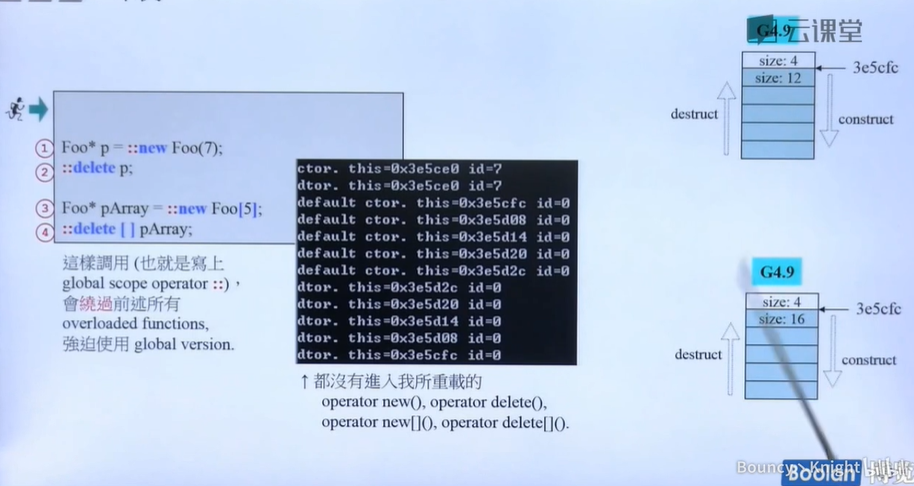

对于全局的，过程类似。

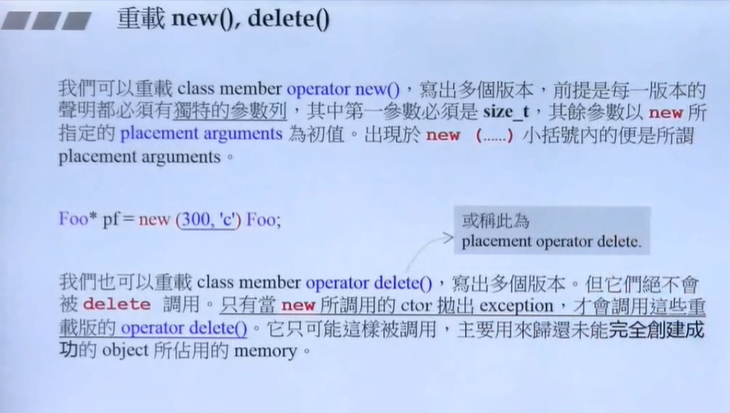

允许重载placement new和delete。下面是事例：

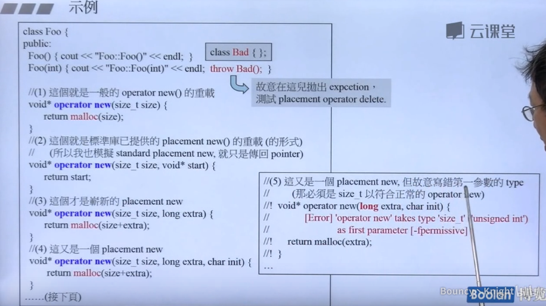

定义了四个operator new函数。前两个标准库已提供。

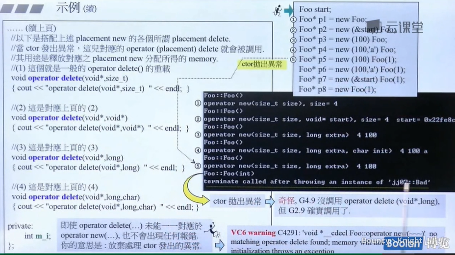

对应上页幻灯片的operator delete操作。

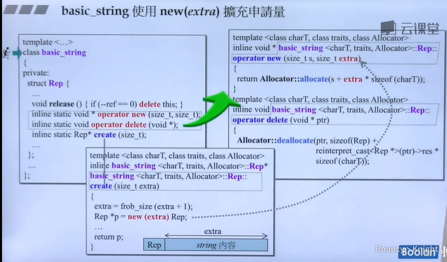

标准库中的例子，多分配内存用来进行reference count。

面向对象部分到此结束。